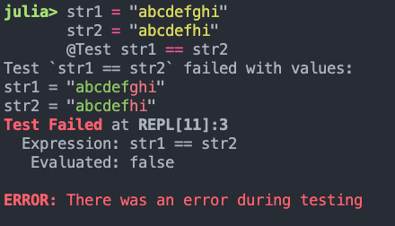
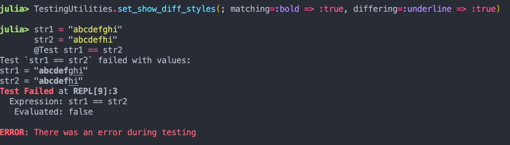
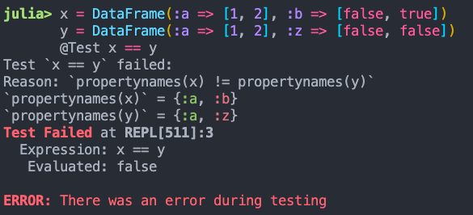
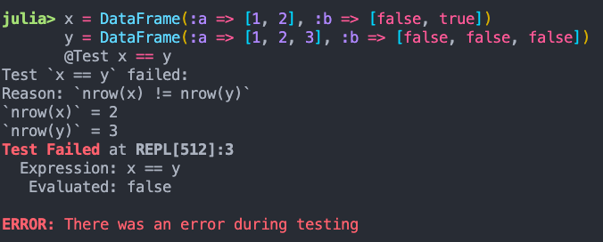
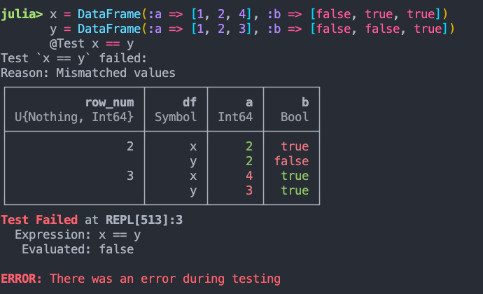

# TestingUtilities

[](https://curtd.github.io/TestingUtilities.jl/stable/)
[](https://curtd.github.io/TestingUtilities.jl/dev/)
[](https://github.com/curtd/TestingUtilities.jl/actions/workflows/CI.yml?query=branch%3Amain)
[](https://coveralls.io/github/curtd/TestingUtilities.jl)

`TestingUtilities` provides macros for improving the visibility into your failing tests.

# Macros
## `@Test` 
An expression invoking `@Test` outputs the value of (automatically-determined) variables of interest when the underlying test errors or fails. E.g., 
```julia
    x = 1
    @Test x^2 == 2
```

Sample output:
```
    Test `x ^ 2 == 2` failed with values:
    `x ^ 2` = 1
    x = 1
    Test Failed at REPL[278]:1
     Expression: x ^ 2 == 2
      Evaluated: false
```

This macro can handle a number of more complicated combinations of Julia expressions, e.g., 
```julia
    test_parity(a; is_odd::Bool) = mod(a,2) == (is_odd ? 1 : 0)
    A = collect(1:10)
    all_is_odd = (false, true)
    @Test all([test_parity(a; is_odd) for a in A for is_odd in all_is_odd])
```

Sample output:
```
    Test `all([test_parity(a; is_odd) for a = A for is_odd = all_is_odd])` failed with values:
    `[test_parity(a; is_odd) for a = A for is_odd = all_is_odd]` = Bool[0, 1, 1, 0, 0, 1, 1, 0, 0, 1, 1, 0, 0, 1, 1, 0, 0, 1, 1, 0]
    A = [1, 2, 3, 4, 5, 6, 7, 8, 9, 10]
```

No values are printed when the test passes. 

## `@test_cases` 
The `@test_cases` macro allows you to compactly evaluate test expressions on test cases with the same underlying data fields, but differing values. The values of the specific test cases that cause each test expression to fail will be printed, similar to `@Test`. 

If run as a standalone macro invocation, the tests will terminate at the first instance of failure, e.g., 
```julia
    @test_cases begin 
        a | b | output 
        1 | 2 | 3
        1 | 2 | 4
        0 | 0 | 1
        0 | 0 | -1
        @test a + b == output
    end
```

Sample output:
```
    Test `a + b == output` failed with values:
    ------
    `a + b` = 3
    output = 4
    a = 1
    b = 2
```

When run inside a `@testset`, all of the failing test values will be printed 

```julia
    @testset "Failing Test" begin
       @test_cases begin 
            a | b | output 
            1 | 2 | 3
            1 | 2 | 4
            0 | 0 | 1
            0 | 0 | -1
            @test a + b == output
        end
    end
```

Sample output:
```
    Test `a + b == output` failed with values:
    ------
    `a + b` = 3
    output = 4
    a = 1
    b = 2
    ------
    `a + b` = 0
    output = 1
    a = 0
    b = 0
    ------
    `a + b` = 0
    output = -1
    a = 0
    b = 0
```

## `@test_eventually`
The `@test_eventually` is used to test that a given test expression eventually returns true (i.e., passes within a prescribed timeout). You can use it to test, for instance, that blocking expressions eventually return within a given time limit or will throw a `TestTimedOutException` in your test set instead.

```julia 
    @testset "Timing Out Test" begin
        done = Ref(false)
        f = (done)->(while !done[]; sleep(0.1) end; true)
        
        # Times out after 1s, checking every 10ms that a value has not returned
        @test_eventually timeout=1s sleep=10ms f(done)
        
        # Test passes within the allotted timeout
        g = @async (sleep(0.3); done[] = true)
        @test_eventually timeout=1s sleep=10ms f(done)
    end
```

Sample output:
```
    Test `f(done)` failed:
    Reason: Test took longer than 1000 milliseconds to pass
    Values:
    done = Base.RefValue{Bool}(false)
    Timing Out Test: Error During Test at REPL[133]:6
    Test threw exception
    Expression: f(done)
    
    Test Summary:   | Pass  Error  Total  Time
    Timing Out Test |    1      1      2  1.5s
    ERROR: Some tests did not pass: 1 passed, 0 failed, 1 errored, 0 broken.
```

# Equality-Comparison Tests 
If your test (using either of the above two macros) involves comparing the equality of two values `x::T` and `y::T`, if `T` is one of the types specified below, a failing test will show a nicely formatted message outlining the specific differences between them. 

## String 
If `x` and `y` are of type `AbstractString`, a failing test will show the common prefix of these strings (if present) printed in green, followed by the differing components of each string in red. E.g., 



If you're unable to discern colour differences between green + red, you can set the styles of the displayed differences using the `TestingUtilities.set_show_diff_styles(; matching, differing)` method. The keyword arguments can be set to any `key => value` pair accepted by `Base.printstyled`, e.g.,



## DataFrames 
If `x` and `y` are of type `AbstractDataFrame`, a failing test will show the reason that the two dataframes are not equal. E.g., 

- `x` and `y` do not have the same columns


- `x` and `y` have differing number of rows


- `x` and `y` have the same number of rows and the same columns, but differing values

